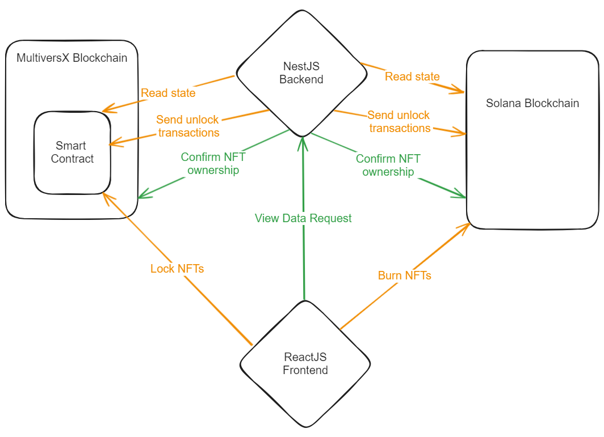
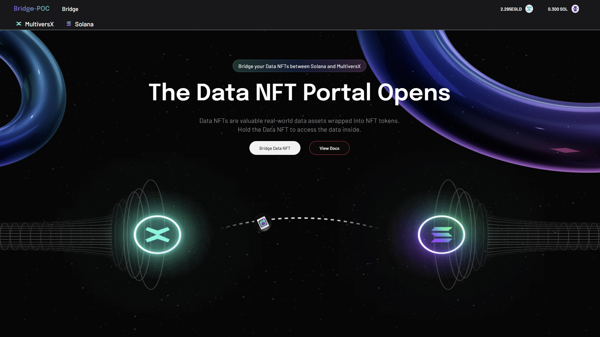
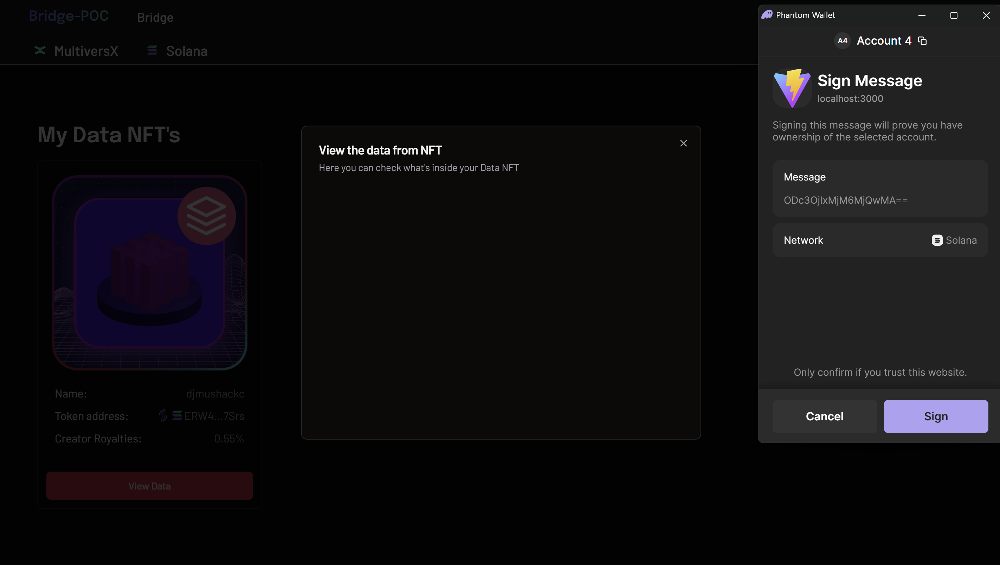
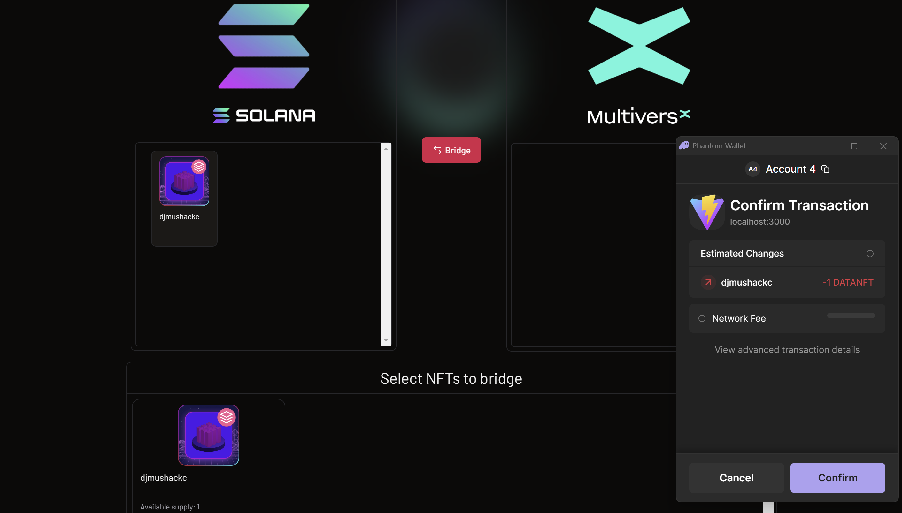

# MultiversX - Solana NFT Bridge

## Introduction

This repository contains an MVP implementation for a bridge between the Solana and MultiversX blockchains. The bridge is designed to allow users to transfer NFTs from MultiversX to Solana and back. The implementation is made for Data NFTs. Data NFTs are Itheum's proprietary technology which enhances normal NFTs by attaching a Data Stream to them. This Data Stream can be used to store any kind of dynamic data, including but not limited to, images, music, videos, documents, etc. Data NFTs allows the attaching of said Data Stream securely, making the stream accessible only to the owner of the NFT.

### What is the Itheum Protocol?

Itheum is a data ownership platform that uses Data NFT technology for the seamless tokenization of real-world data. Unlike traditional "NFT gated content" where NFTs are used to simply gate centralized web pages or apps, Data NFTs enable gated content to be activated on the token itself, allowing a user with a Data NFT to move to any public platform and unlock the underlying data. For example, a Music Data NFT holder can move to any community built app that uses Itheum's Data NFT SDK to build a music player, if the user does not like that specific music player, they can take their music and move to any other music player implementation. This enables for "data to be tokenized and also portable". Itheum provides a suite of tools built on Data NFTs, ranging from a Data NFT Marketplace (NFT + Data Marketplace), App/Widget frameworks to build apps on top of Data NFTs (music players, data visualization UIs etc), SDKs (for 3rd parties to pragmatically integrate the Itheum protocol into their apps) and many more. The Itheum protocol is explained in detail here : [https://cointelegraph.com/sponsored/itheum-data-ownership-redefined](https://cointelegraph.com/sponsored/itheum-data-ownership-redefined)

## Requirements

Node.js 18.19.0+
NPM version 10.2.3+

## Quick start

The quickest way to get started and test the project is by going inside the frontend directory, then using:

```bash
npm install
npm start
```

(Optional) If you want to host your own backend, you can do so by going inside the backend directory, then using:

```bash
npm install
npm run start:dev
```

(Optional) If you want to deploy your own MvX smart contract, you can do so by going inside the mvx-sc directory, then using:

```bash
mxpy contract build
```

After building, one can deploy the smart contract by following the instructions in the [MvX documentation](https://github.com/multiversx/mx-sdk-py-cli/blob/main/CLI.md#contractdeploy)
Instructions on installing mxpy can be found [here](https://docs.multiversx.com/sdk-and-tools/sdk-py/installing-mxpy/)

## Abstract

Blockchain interoperability and the ability to transfer assets between different blockchains is a key feature for the future of blockchain technology. That being said, considering there is no production-ready NFT bridge available between MultiversX and Solana, we have decided to create a proof of concept for such a bridge. Such a bridge would give MultiversX & Solana users access to a wider range of NFTs, liquidity and trading opportunities.

The implementation can easily be generalized to normal NFTs as well, even though it is made specifically for Data NFTs and this is our plan of the launch version of this bridge (support Data NFTs and regular NFTs as well)

## Architecture

The application is divided into three main parts: the frontend, the backend, a MultiversX smart contract.

The frontend is a user-friendly interface built with React.js, enabling interaction with the bridge features. The frontend allows the user to do the following:

- Connect their MultiversX wallet
- Connect their Solana wallet
- View their MultiversX Data NFTs
- View their Solana Data NFTs
- View their Data NFT attached Data Streams securely on Solana Data NFTs
- Transfer Data NFTs from MultiversX to Solana
- Transfer Data NFTs from Solana to MultiversX

The backend is a robust Nest.js server responsible for interacting with both blockchains, handling NFT conversion, and facilitating smooth transfers. The backend is responsible for the following:

- Read the state of the MultiversX Smart Contract to see which NFTs are locked for bridging
- For NFTs locked on MultiversX side, the backend will mint the NFT on Solana and send it to the user
- For NFTs burned on Solana side, the backend will unlock the NFT on MultiversX and send it to the user
- Allow users to view the attached Data Streams for their Data NFTs on Solana

The MultiversX smart contract facilitates the initial NFT transfer process and is responsible for the following:

- Accept locking of NFTs for bridging
- Unlock NFTs that are bridged back to MultiversX



## Directory structure

- backend: Contains the code for the backend service. Uses the recommended and approved by the MultiversX [folder structure](https://github.com/multiversx/mx-template-service) within. The backend is written in Nest.js. Inside the backend folder, there is a folder called config with different values (set for the MultiversX devnet). Inside the src folder, there is a folder called common, which contains general purpose configs, database connection setups and entities. We also have an endpoints folder. Inside each folder in endpoints, a different endpoint is coded.
- docs: Contains images used in the README.md file
- frontend: Contains the React.js application for the frontend. All relevant files are inside the src folder, having different folders for components, pages, store, etc.
- mvx-sc: Contains the MultiversX smart contract. The smart contract is written in Rust and uses the MultiversX Rust SDK. The relevant code is inside the src folder. The events file is where we defined events so we can listen to them from the backend and the lock file is where the logic and memory storage of the contract are done.

## Important technologies used

- [Ironforge RPC Gateway](https://www.ironforge.cloud/docs)
  The Ironforge RPC Gateway is a Solana RPC Gateway that allows users to interact with the Solana blockchain. It is used to read the state of the Solana blockchain, allowing to show users their owned NFTs on the Solana Blockchain.
- [SolanaFM](https://docs.solana.fm/)
  SolanaFM is used read information about the NFTs from the Solana blockchain. If a user wants to see detailed information about an NFT, they can use SolanaFM using a press of a button to do so.
- [Solana Web3JS](https://solana-labs.github.io/solana-web3.js/)
  Used to interact with Solana RPC gateways.
- [Metaplex Foundation JS SDK](https://github.com/metaplex-foundation/js)
  Used to interact with the Metaplex protocol, mint Fungible Assets, login with SOL wallet, etc.
- [UMI Framework](https://github.com/metaplex-foundation/umi)
  User to easily interact with Solana programs through zero-dependency, ready-made interfaces.
- [Itheum JS SDK](https://github.com/Itheum/sdk-mx-data-nft)
  The Itheum SDKs are used to interact with the Data NFTs and easily read the attached data streams. The SDKs are used to show the attached data streams for the Data NFTs on Solana.
- [MultiversX Rust SDK](https://github.com/multiversx/mx-sdk-rs)
  The MultiversX Rust SDK is used in order to create the MultiversX smart contract for locking NFTs for bridging.
- [MultiversX dApp JS SDK](https://github.com/multiversx/mx-sdk-dapp)
  The MultiversX dApp SDK allows developers to easily interact with the MultiversX blockchain. It is used for login state management and blockchain state reading.

## Flow



### Bridge NFTs from MultiversX to Solana

1. Open the bridge app
2. Connect your MultiversX wallet
3. Connect your Solana wallet
4. Select an NFT to bridge from MultiversX
5. Confirm the bridge & wait for the transfer to be done (under 1 minute)
6. Observe that the NFT is now visible in your Solana wallet

### Viewing Data Stream for Solana Data NFTs

1. Open the bridge app
2. Connect your Solana wallet
3. Go to the Solana inventory page
4. Pick a Data NFT (you have to own at least one)
5. Click on the "View Data" button
6. Sign the message with your Phantom wallet
7. Wait for the ownership to be confirmed and for the data to be shown



### Bridge NFTs back from Solana to MultiversX

1. Open the bridge app
2. Connect your MultiversX wallet
3. Connect your Solana wallet
4. Pick an NFT to bridge from Solana
5. Confirm the bridge & wait for the transfer to be done (under 1 minute)
6. Observe that the NFT is now visible in your MultiversX wallet



## Next steps

- Improve architecture and security by adding a Solana Smart Contract for locking, similarly to how NFTs are locked on MultiversX side.
- Convert architecture of bridge to be fully "burn<>mint" instead of "lock<>mint", improving security on both the Solana and MultiversX Smart Contracts/Programs.
- Add support for normal NFTs, allowing any regular MultiversX or Solana NFT collections to allow their users to move back and forth between the chains.
- Audit the bridge solution on both sides to ensure security.
- Improve UX by allowing bridging of multiple NFTs through a single transaction.
- Improve UI with better design.

[contributors-shield]: https://img.shields.io/github/contributors/Itheum/sol-mvx-nft-bridge-poc?style=for-the-badge
[contributions-url]: https://github.com/Itheum/sol-mvx-nft-bridge-poc/graphs/contributors
[React.js]: https://img.shields.io/badge/-ReactJs-61DAFB?logo=react&logoColor=white&style=for-the-badge
[React-url]: https://reactjs.org/
[Nest.js]: https://img.shields.io/badge/-NestJs-ea2845?style=flat-square&logo=nestjs&logoColor=white
[Nest-url]: https://nestjs.com/
